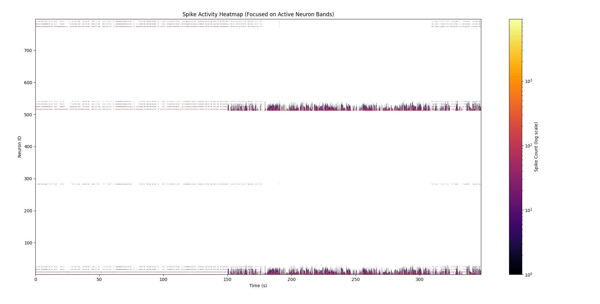
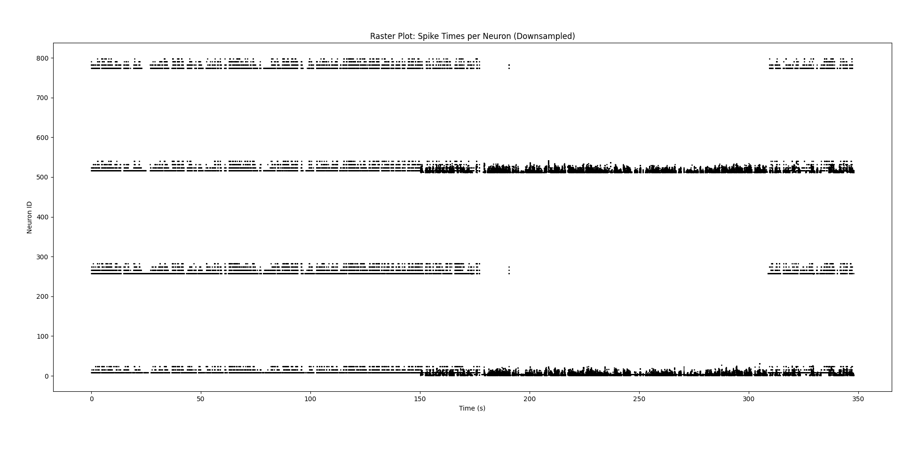
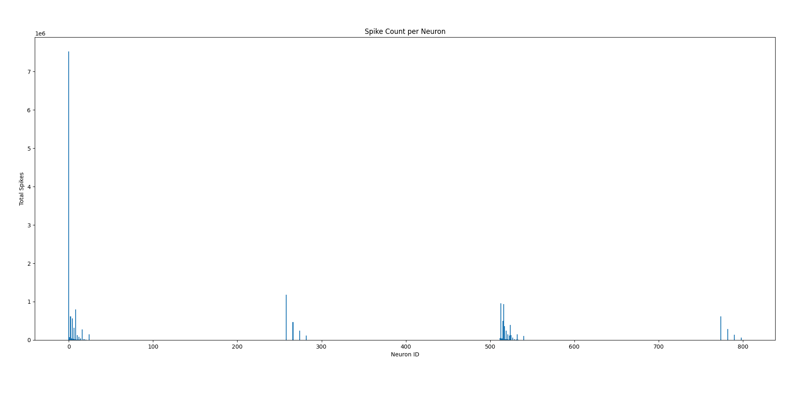
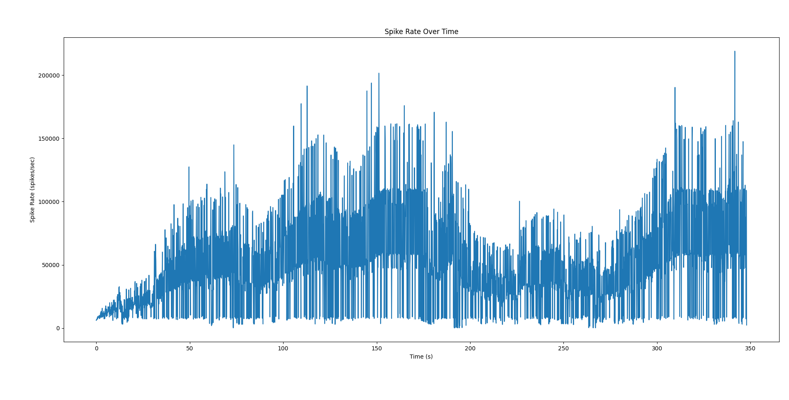

# FPGA Spiking Neural Network (SNN) System

   

This repository showcases a **fully custom Spiking Neural Network (SNN)** implemented on a **Xilinx Artix-7 FPGA (XC7A35T-2FTG256I)**.  
The design was built from scratch in **handwritten Verilog**, featuring **on-chip Spike-Timing-Dependent Plasticity (STDP)** and real-time spike streaming over UART.  

A **next-generation architecture** is currently in development, but this prototype demonstrates scalable neuromorphic computation on real hardware, running live experiments with **speech-based audio stimuli (Ms. Rachel videos)**.

---

## 🔹 Key Features

- 🚀 **Custom Neuromorphic Hardware:** Handwritten Verilog neuron and synapse logic, no high-level synthesis.  
- 🎛️ **On-Chip STDP Learning:** Real-time adaptive synaptic weights.  
- 🖧 **UART Data Streaming:** Low-latency spike data transfer to a host PC for live visualization.  
- 🎶 **Audio-Driven Experiments:** Tested with naturalistic speech input to observe emergent network dynamics.  
- ⚡ **Optimized Pipeline:** Designed for high spike throughput at low power.

---

## 📊 Visual Results

| Spike Activity Heatmap | Raster Plot |
|-----------------------|------------|
|  |  |

| Spike Count per Neuron | Spike Rate Over Time |
|-----------------------|---------------------|
|  |  |

---

### 🧩 Figure Details
- **Heatmap:** Log-scaled spike density across active neuron populations.  
- **Raster Plot:** Temporal firing patterns of 800+ neurons.  
- **Spike Count Distribution:** Per-neuron spike activity over time.  
- **Spike Rate:** Network-wide firing dynamics, revealing activity bursts and adaptation patterns.

---

## 🛠️ Technical Notes
- **FPGA:** Xilinx Artix-7 XC7A35T-2FTG256I (Alchitry Au V2)  
- **Language:** Verilog RTL (fully handwritten)  
- **Toolchain:** Xilinx Vivado  
- **Learning:** Fully hardware-implemented **STDP plasticity**  
- **Streaming:** UART-based spike telemetry with Python visualization tools  
- **Experiment Setup:** Ms. Rachel speech/video clips fed as input to analyze network response

---

> ⚠️ **Source Code Not Public:**  
> This repository is **for documentation purposes only**.  
> All HDL code and design files remain private.
